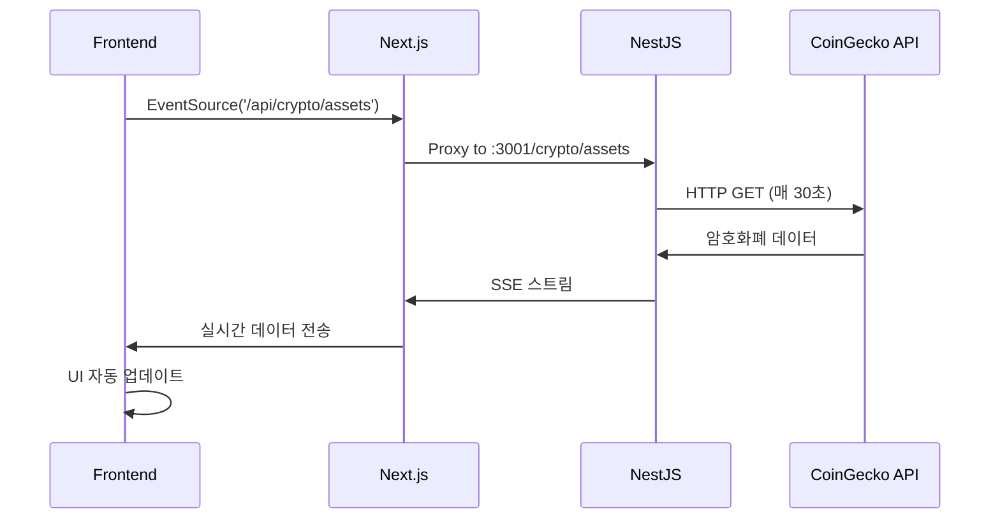

# 🚀 Crypto Dashboard with SSE

실시간 암호화폐 대시보드 - Server-Sent Events(SSE)를 활용한 실시간 데이터 스트리밍 프로젝트

## 📋 프로젝트 개요

이 프로젝트는 **NestJS**와 **Next.js**를 사용하여 구축된 실시간 암호화폐 정보 대시보드입니다. **Server-Sent Events(SSE)**를 활용하여 서버에서 클라이언트로 실시간 데이터를 스트리밍하며, **CoinGecko API**로부터 최신 암호화폐 시장 데이터를 제공합니다.

## 🏗️ 기술 스택

### Backend
- **NestJS** - TypeScript 기반 Node.js 프레임워크
- **RxJS** - 반응형 프로그래밍 라이브러리
- **Axios** - HTTP 클라이언트
- **Server-Sent Events (SSE)** - 실시간 데이터 스트리밍

### Frontend
- **Next.js 15** - React 기반 풀스택 프레임워크
- **React 19** - 사용자 인터페이스 라이브러리
- **Tailwind CSS 4** - 유틸리티 퍼스트 CSS 프레임워크
- **DaisyUI 5** - Tailwind CSS 컴포넌트 라이브러리
- **TypeScript** - 정적 타입 검사

## 🌟 주요 기능

### 🔥 실시간 데이터 스트리밍
- Server-Sent Events(SSE)를 통한 실시간 암호화폐 가격 업데이트
- 30초마다 자동으로 최신 시장 데이터 갱신
- 브라우저 네이티브 EventSource API 활용

### 📊 암호화폐 정보 대시보드
- 실시간 가격, 시가총액, 24시간 거래량 표시
- 24시간 가격 변동률과 고가/저가 정보
- 시가총액 순위별 상위 20개 암호화폐 표시

### 🎨 현대적인 UI/UX
- DaisyUI 컴포넌트를 활용한 아름다운 카드 레이아웃
- 반응형 그리드 시스템 (1~5열 자동 조정)
- 가격 상승/하락에 따른 색상 표시
- 로딩 스피너와 상태 관리

### 🛡️ 타입 안정성
- 전체 프로젝트 TypeScript 적용
- 엄격한 타입 정의와 인터페이스
- 안전한 옵셔널 체이닝으로 런타임 에러 방지

## 📁 프로젝트 구조

```
crypto-dashboard-with-sse/
├── backend/                    # NestJS API 서버
│   ├── src/
│   │   ├── crypto/            # 암호화폐 모듈
│   │   │   ├── crypto.controller.ts  # SSE 엔드포인트
│   │   │   ├── crypto.service.ts     # 비즈니스 로직
│   │   │   └── crypto.module.ts      # 모듈 정의
│   │   ├── app.module.ts      # 앱 모듈
│   │   └── main.ts           # 앱 진입점
│   └── package.json
└── frontend/                  # Next.js 클라이언트
    ├── src/
    │   └── app/
    │       ├── page.tsx      # 메인 대시보드 페이지
    │       ├── layout.tsx    # 레이아웃 컴포넌트
    │       └── globals.css   # 글로벌 스타일
    ├── next.config.ts        # Next.js 설정 (API 프록시)
    └── package.json
```

## 🔧 설치 및 실행

### 1. 프로젝트 클론
```bash
git clone <repository-url>
cd crypto-dashboard-with-sse
```

### 2. Backend 설정 및 실행
```bash
cd backend
npm install
npm run start:dev
```
Backend 서버가 `http://localhost:3001`에서 실행됩니다.

### 3. Frontend 설정 및 실행
```bash
cd frontend
npm install
npm run dev
```
Frontend 서버가 `http://localhost:3000`에서 실행됩니다.

### 4. 브라우저에서 확인
`http://localhost:3000`에 접속하여 실시간 암호화폐 대시보드를 확인하세요.

## 📡 SSE (Server-Sent Events) 구현 상세

### Backend SSE 엔드포인트
```typescript
@Controller('crypto')
export class CryptoController {
  @Sse('assets')  // GET /crypto/assets
  getAssets() {
    return timer(0, 30000).pipe(  // 30초마다 실행
      concatMap(() => this.cryptoService.getAssets()),
    );
  }
}
```

### Frontend SSE 연결
```typescript
useEffect(() => {
  const eventSource = new EventSource('/api/crypto/assets');

  eventSource.onmessage = (event) => {
    const cryptoData = JSON.parse(event.data);
    setCryptos(cryptoData);  // 상태 업데이트
  };

  return () => {
    eventSource.close();  // 컴포넌트 언마운트 시 연결 해제
  };
}, []);
```

### API 프록시 설정
```typescript
// next.config.ts
async rewrites() {
  return [
    {
      source: '/api/:path*',
      destination: 'http://localhost:3001/:path*',
    },
  ];
}
```

## 🎯 데이터 플로우



## 🔄 SSE vs 다른 실시간 통신 방법

| 특성 | SSE | WebSocket | Polling |
|------|-----|-----------|---------|
| **통신 방향** | 서버 → 클라이언트 | 양방향 | 클라이언트 → 서버 |
| **프로토콜** | HTTP | TCP | HTTP |
| **구현 복잡도** | 간단 | 복잡 | 매우 간단 |
| **실시간성** | 높음 | 매우 높음 | 낮음 |
| **서버 부하** | 중간 | 낮음 | 높음 |
| **브라우저 지원** | 네이티브 | 네이티브 | 네이티브 |
| **자동 재연결** | ✅ | 수동 구현 필요 | N/A |

## 💡 주요 학습 포인트

### 1. **NestJS SSE 구현**
- `@Sse()` 데코레이터 사용법
- RxJS Observable을 통한 스트림 생성
- `timer()`와 `concatMap()` 조합

### 2. **타입 안전성**
- TypeScript 인터페이스 정의
- 옵셔널 체이닝(`?.`)과 Nullish Coalescing(`??`) 활용
- 런타임 에러 방지

### 3. **Modern React Patterns**
- `useEffect`를 통한 SSE 연결 관리
- 상태 관리와 실시간 업데이트
- 컴포넌트 생명주기 관리

### 4. **CSS-in-JS with Tailwind**
- Tailwind CSS 4 최신 문법
- DaisyUI 컴포넌트 활용
- 반응형 디자인 구현

## 🚀 확장 가능성

- **WebSocket 업그레이드**: 양방향 통신이 필요한 경우
- **Redis 연동**: 캐싱 및 세션 관리
- **Database 연동**: 사용자 맞춤 포트폴리오
- **차트 라이브러리**: 가격 변동 그래프
- **알림 시스템**: 가격 알림 기능
- **PWA**: 모바일 앱 경험

## 📝 라이선스

MIT License

## 👨‍💻 개발자

실시간 웹 애플리케이션과 SSE 학습을 위한 프로젝트입니다.

---

💡 **SSE를 활용한 실시간 데이터 스트리밍의 완벽한 예시 프로젝트입니다!**