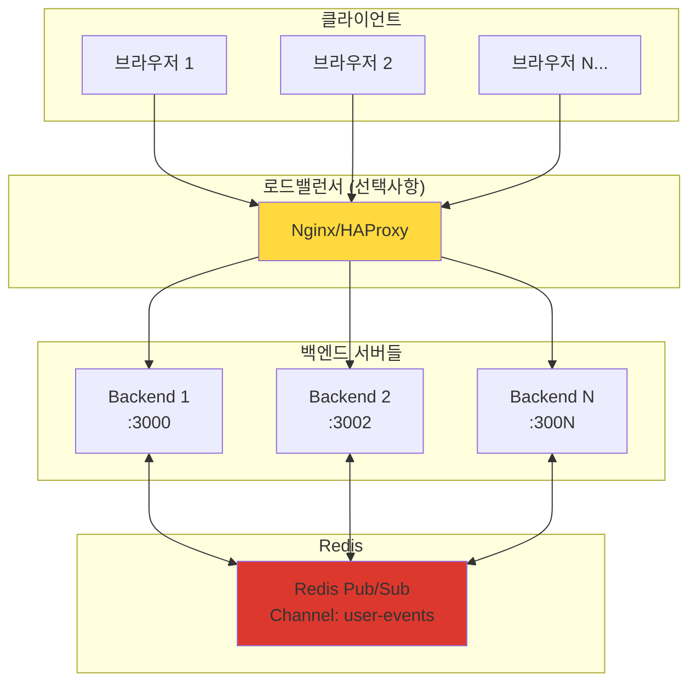

# 시스템 아키텍처

## 📋 개요

이 프로젝트는 **NestJS 백엔드**와 **Next.js 프론트엔드**를 활용한 **Redis 기반 분산 실시간 통신 시스템**입니다.
Turborepo를 사용한 모노레포 구조로, **Redis Pub/Sub**, SSE(Server-Sent Events), EventEmitter를 통해 확장 가능한 실시간 데이터 전송을 구현했습니다.

## 🏗️ 전체 구조

```
nestjs-nextjs-event-driven/
├── apps/
│   ├── backend/          # NestJS 백엔드 (포트 3000, 3002...)
│   │   ├── src/
│   │   │   ├── accounts/     # 계정 관리 모듈
│   │   │   ├── events/       # SSE 이벤트 스트림 모듈 (Redis Subscriber)
│   │   │   ├── snapshots/    # 스냅샷 생성 모듈 (Redis Publisher)
│   │   │   ├── redis/        # Redis 연결 관리 모듈
│   │   │   └── main.ts       # 애플리케이션 진입점
│   │   └── package.json
│   └── web/             # Next.js 프론트엔드 (포트 3001)
│       ├── app/
│       │   ├── events/       # 이벤트 관련 훅
│       │   ├── page.tsx      # 메인 페이지
│       │   └── layout.tsx
│       └── package.json
├── packages/            # 공유 패키지
│   ├── eslint-config/   # ESLint 설정
│   └── typescript-config/ # TypeScript 설정
├── docker-compose.yml   # 개발환경 컨테이너 설정
├── nginx.conf          # 로드밸런서 설정
└── turbo.json          # Turborepo 설정
```

## 🎯 핵심 기술 스택

### 백엔드 (NestJS)

- **Redis**: 분산 메시지 브로커 (Pub/Sub)
- **ioredis**: Redis 클라이언트 라이브러리
- **`@nestjs/event-emitter`**: 내부 이벤트 시스템 관리
- **RxJS**: 리액티브 스트림 및 비동기 데이터 처리
- **SSE (Server-Sent Events)**: 실시간 클라이언트 통신
- **TypeScript**: 타입 안전성 보장

### 프론트엔드 (Next.js)

- **EventSource API**: SSE 연결 관리
- **React Hooks**: 이벤트 구독 및 상태 관리
- **TypeScript**: 타입 안전성 보장

### 인프라 & 도구

- **Redis**: 메시지 브로커 및 캐시 (Docker)
- **Turborepo**: 모노레포 빌드 시스템
- **Docker**: Redis 컨테이너 실행
- **Nginx**: 로드밸런서 (선택사항)
- **ESLint & Prettier**: 코드 품질 관리

## 🏗️ Redis 기반 분산 아키텍처

### **전체 시스템 구조**



### **핵심 특징**

- ✅ **무제한 확장**: 백엔드 서버를 원하는 만큼 추가 가능
- ✅ **장애 복구**: 한 서버가 죽어도 다른 서버에서 이벤트 처리 계속
- ✅ **실시간 동기화**: 모든 서버가 동일한 이벤트 수신
- ✅ **로드밸런싱**: 트래픽을 여러 서버로 분산

## 🔧 주요 모듈 구조

### 1. RedisModule (새로 추가)

**역할**: Redis 연결 관리 및 Pub/Sub 클라이언트 제공

```typescript
@Global()
@Module({
  providers: [
    {
      provide: 'REDIS_PUB_CLIENT',
      useFactory: () => new Redis({ host: 'localhost', port: 6379 }),
    },
    {
      provide: 'REDIS_SUB_CLIENT',
      useFactory: () => new Redis({ host: 'localhost', port: 6379 }),
    },
  ],
  exports: ['REDIS_PUB_CLIENT', 'REDIS_SUB_CLIENT'],
})
export class RedisModule {}
```

**주요 기능**:

- Publisher/Subscriber 클라이언트 분리 관리
- 전역 모듈로 모든 서비스에서 사용 가능
- 연결 상태 모니터링 및 에러 핸들링

### 2. EventsModule (Redis Subscriber로 변경)

**역할**: Redis에서 이벤트를 구독하여 SSE로 클라이언트에 전달

```typescript
@Injectable()
export class EventsService implements OnModuleInit, OnModuleDestroy {
  constructor(@Inject('REDIS_SUB_CLIENT') private readonly subscriber: Redis) {}

  async onModuleInit() {
    await this.subscriber.subscribe('user-events');
    this.subscriber.on('message', this.handleRedisMessage.bind(this));
  }

  private handleRedisMessage(message: string) {
    const { userId, eventType, data } = JSON.parse(message);
    this.deliverEventToUser(userId, eventType, data);
  }
}
```

**주요 기능**:

- Redis 채널 구독 (`user-events`)
- 사용자별 독립적인 SSE 스트림 관리
- RxJS Observable을 통한 실시간 데이터 스트림
- Keep-alive 신호로 연결 안정성 보장 (15초 간격)
- 연결 해제 시 자동 리소스 정리

### 3. AccountsModule

**역할**: 계정 생성 및 관리

**주요 기능**:

- 계정 생성 REST API 제공
- 계정 생성 시 자동으로 스냅샷 생성 이벤트 발생
- EventEmitter2를 통한 내부 이벤트 발행

### 4. SnapshotsModule (Redis Publisher로 변경)

**역할**: 이벤트 리스너 및 스냅샷 생성 후 Redis로 결과 발행

```typescript
@Injectable()
export class SnapshotsService {
  constructor(@Inject('REDIS_PUB_CLIENT') private readonly redis: Redis) {}

  @OnEvent('snapshots.generate')
  async generateSnapshots(event: GenerateSnapshotsEvent) {
    // 스냅샷 생성 로직

    // Redis로 완료 이벤트 발행
    await this.redis.publish(
      'user-events',
      JSON.stringify({
        userId: event.userId,
        eventType: 'snapshots.generated',
        data: { snapshotCount, timestamp, serverId },
      }),
    );
  }
}
```

**주요 기능**:

- `@OnEvent` 데코레이터를 통한 이벤트 리스닝
- 비동기 스냅샷 생성 처리
- Redis Pub/Sub를 통한 완료 알림 발행

## 🔄 이벤트 기반 아키텍처 패턴

### 1. 분산 이벤트 발행-구독 패턴

```typescript
// 이벤트 발행 (Redis Publisher)
await this.redis.publish(
  'user-events',
  JSON.stringify({
    userId,
    eventType,
    data,
  }),
);

// 이벤트 구독 (Redis Subscriber - 모든 서버에서)
this.subscriber.on('message', (channel, message) => {
  const { userId, eventType, data } = JSON.parse(message);
  this.deliverEventToUser(userId, eventType, data);
});
```

### 2. 실시간 스트림 패턴

```typescript
// RxJS를 활용한 스트림 관리
return merge(userStream.asObservable(), keepAlive$).pipe(
  finalize(() => {
    console.log(`User ${userId} disconnected from server ${serverId}`);
    this.userStreams.delete(userId);
  }),
);
```

### 3. 클라이언트 이벤트 구독 패턴

```typescript
// React Hook을 통한 이벤트 구독
useEvents(['snapshots.generated'], (eventType, data) => {
  console.log(`이벤트 수신: ${eventType}`, data);
});
```

## 🌟 아키텍처의 장점

### 1. **확장성 (Scalability)**

- 백엔드 서버를 무제한으로 추가 가능
- Redis가 모든 서버 간 이벤트 동기화 처리
- 로드밸런서를 통한 효율적인 트래픽 분산

### 2. **고가용성 (High Availability)**

- 단일 서버 장애 시에도 서비스 계속 운영
- Redis 클러스터링으로 Redis 자체의 고가용성 확보 가능
- 자동 장애 복구 및 재연결 메커니즘

### 3. **실시간성 (Real-time)**

- Redis 메모리 기반 Pub/Sub으로 < 1ms 지연시간
- SSE를 통한 즉각적인 클라이언트 알림
- Keep-alive로 연결 안정성 보장

### 4. **유지보수성 (Maintainability)**

- 각 모듈이 단일 책임 원칙 준수
- Redis 모듈을 통한 중앙집중식 연결 관리
- TypeScript를 통한 타입 안전성 보장

### 5. **성능 (Performance)**

- Redis 메모리 기반 처리로 높은 성능
- 연결 풀링으로 효율적인 리소스 사용
- 사용자별 스트림 분리로 격리된 처리

## 🔍 성능 고려사항

### 1. **Redis 연결 관리**

- Publisher/Subscriber 클라이언트 분리
- 연결 풀링 및 재연결 로직
- 메모리 사용량 모니터링

### 2. **메시지 처리 최적화**

- JSON 직렬화/역직렬화 최적화
- 배치 처리를 통한 처리량 향상
- 메시지 크기 제한 고려

### 3. **모니터링 및 로깅**

```typescript
// 서버별 식별을 위한 로깅
console.log(`📤 Published event from server: ${process.env.SERVER_ID}`);
console.log(`📨 Received event on server: ${process.env.SERVER_ID}`);
```

## 🚀 확장 가능성

### 1. **다중 이벤트 채널**

```typescript
// 채널별 이벤트 분리
await this.redis.publish('user-events', userEventData);
await this.redis.publish('system-events', systemEventData);
await this.redis.publish('analytics-events', analyticsData);
```

### 2. **이벤트 영속성**

- Redis Streams를 활용한 이벤트 히스토리 관리
- 메시지 큐 시스템 (RabbitMQ, Apache Kafka) 통합
- 이벤트 소싱 패턴 구현

### 3. **보안 강화**

- Redis AUTH를 통한 인증
- TLS 암호화 연결
- 사용자별 권한 기반 이벤트 필터링

### 4. **클라우드 네이티브**

- Redis Cluster for high availability
- Kubernetes 환경에서의 오토스케일링
- 서비스 메시 (Istio) 통합

## 📊 모니터링 및 로깅

### 현재 구현된 로깅

```typescript
console.log('✅ Redis Publisher connected');
console.log('📥 EventsService: Subscribed to Redis channel: user-events');
console.log(`📤 Published event to Redis: ${eventType} for user ${userId}`);
console.log(`📨 Received from Redis: ${eventType} for user ${userId}`);
```

### 확장 가능한 모니터링

- 연결 수 및 처리량 메트릭
- 이벤트 처리 지연시간 측정
- Redis 메모리 사용량 모니터링
- 에러율 및 재연결 통계
