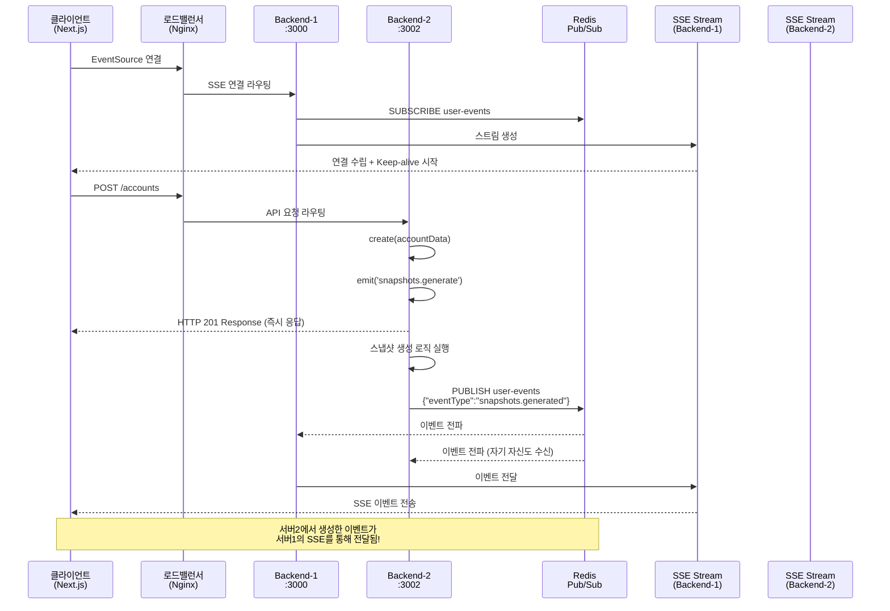

# 이벤트 플로우 가이드

## 📋 개요

이 문서는 **Redis Pub/Sub 기반 분산 시스템**에서 발생하는 이벤트들의 흐름과 상호작용을 상세히 설명합니다.
다중 서버 환경에서 Redis를 통한 이벤트 동기화와 실시간 데이터 전송의 전체적인 플로우를 이해할 수 있습니다.

## 🔄 전체 이벤트 플로우 다이어그램



## 🚀 단계별 상세 플로우

### 1단계: 클라이언트 연결 수립

#### 프론트엔드 (Next.js)

```typescript
// apps/web/app/page.tsx
useEvents(['snapshots.generated'], (eventType, data) => {
  console.log(`✅ [${eventType}] event received from server: ${data.serverId}`);
});
```

#### SSE 연결 초기화

```typescript
// apps/web/app/events/useEvents.ts
const eventSource = new EventSource('/api/events/sse');
// Next.js 프록시를 통해 백엔드로 전달됨
```

#### 백엔드 스트림 생성 (Redis Subscriber)

```typescript
// apps/backend/src/events/events.service.ts
async onModuleInit() {
  await this.subscriber.subscribe('user-events');

  this.subscriber.on('message', (channel, message) => {
    if (channel === 'user-events') {
      this.handleRedisMessage(message);
    }
  });
}

getEvent$(userId: string): Observable<MessageEvent> {
  const userStream = this.getOrCreateStream(userId);
  const keepAlive$ = interval(15000).pipe(
    map(() => ({
      type: 'ping',
      serverId: process.env.SERVER_ID,
      timestamp: Date.now()
    }))
  );

  return merge(userStream.asObservable(), keepAlive$);
}
```

**결과**: 클라이언트와 서버 간 실시간 통신 채널 수립 + Redis 채널 구독

### 2단계: 계정 생성 API 호출

#### HTTP 요청 (로드밸런서를 통해)

```http
POST /accounts
Content-Type: application/json

{
  "name": "다중서버테스트",
  "balance": 999999
}
```

#### 컨트롤러 처리 (어떤 서버든 상관없음)

```typescript
// apps/backend/src/accounts/accounts.controller.ts
@Post()
createAccount(@Body() createAccountRequest: CreateAccountRequest) {
  return this.accountsService.create(createAccountRequest);
}
```

**결과**: 즉시 HTTP 응답 반환 (비동기 처리와 분리)

### 3단계: 내부 이벤트 발생

#### 서비스 레이어에서 이벤트 발행

```typescript
// apps/backend/src/accounts/accounts.service.ts
create(account: any) {
  const newAccount = {
    id: this.accounts.length + 1,
    ...account,
    createdAt: new Date().toISOString(),
  };

  this.accounts.push(newAccount);

  // 🔥 핵심: 내부 이벤트 발행
  this.eventEmitter.emit(
    'snapshots.generate',
    new GenerateSnapshotsEvent('123')
  );

  return newAccount;
}
```

**결과**: EventEmitter2를 통해 시스템 내부로 이벤트 전파

### 4단계: 스냅샷 생성 및 Redis 발행

#### 이벤트 수신 및 Redis 발행

```typescript
// apps/backend/src/snapshots/snapshots.service.ts
@OnEvent('snapshots.generate')
async generateSnapshots(event: GenerateSnapshotsEvent) {
  console.log(`🔄 SnapshotsService: Starting snapshot generation for user ${event.userId}`);

  // 1. 기존 비즈니스 로직 - 스냅샷 생성
  const accounts = this.accountsService.getAccounts();
  for (const account of accounts) {
    this.snapshots.push({
      account,
      date: new Date(),
      userId: event.userId,
    });
  }

  // 2. 🔥 Redis Pub/Sub로 이벤트 발행 (모든 서버로 전파)
  await this.redis.publish('user-events', JSON.stringify({
    userId: event.userId,
    eventType: 'snapshots.generated',
    data: {
      snapshotCount: accounts.length,
      timestamp: new Date().toISOString(),
      serverId: process.env.SERVER_ID || 'unknown'
    }
  }));

  console.log(`📤 SnapshotsService: Published event to Redis: snapshots.generated for user ${event.userId}`);
}
```

**결과**: Redis를 통해 **모든 백엔드 서버**로 완료 이벤트 전파

### 5단계: 실시간 클라이언트 알림 (분산 환경)

#### Redis 메시지 수신 (모든 서버에서)

```typescript
// apps/backend/src/events/events.service.ts
private handleRedisMessage(message: string) {
  try {
    const { userId, eventType, data } = JSON.parse(message);
    console.log(`📨 EventsService: Received from Redis: ${eventType} for user ${userId} from server ${data.serverId}`);

    // 해당 사용자의 SSE 스트림으로 전달
    this.deliverEventToUser(userId, eventType, data);
  } catch (error) {
    console.error('❌ EventsService: Error parsing Redis message:', error);
  }
}

private deliverEventToUser(userId: string, eventType: string, data: any) {
  const userStream = this.userStreams.get(userId);
  if (userStream) {
    userStream.next({
      data: { eventType, ...data }
    });
    console.log(`✅ EventsService: Delivered event to user ${userId}: ${eventType}`);
  } else {
    console.log(`⚠️ EventsService: No active stream for user ${userId}`);
  }
}
```

#### 클라이언트 이벤트 수신

```typescript
// apps/web/app/events/useEvents.ts
eventSource.onmessage = (event) => {
  const parsedData = JSON.parse(event.data);

  // ping 메시지는 무시
  if (parsedData.type === 'ping') {
    console.log('🏓 Ping received from server:', parsedData.serverId);
    return;
  }

  if (eventTypes.includes(parsedData.eventType)) {
    callback(parsedData.eventType, parsedData);
  }
};
```

**결과**: 실시간으로 클라이언트에 작업 완료 알림 전달 (어느 서버에서 생성되든 상관없음)

## ⏱️ 다중 서버 타이밍 다이어그램

```
시간축 ─────────────────────────────────────────────────────────────────►

클라이언트:     [SSE 연결]──[API 호출]──────────────────[이벤트 수신]
                   │         │                            │
서버1 (SSE):    [스트림 생성]─│─────────[Redis 수신]─────[SSE 전송]
                   │         │              │              │
서버2 (API):       │    [요청 처리]─[응답]   │              │
                   │         │      │       │              │
Redis:             │         │      └─[이벤트 발행]────────┘
                   │         │              │
시간 경과:       0ms      100ms    150ms   200ms         250ms

핵심: 서버2에서 생성한 이벤트가 Redis를 통해 서버1의 SSE로 전달됨!
```

## 🔍 Redis 기반 이벤트 시스템의 핵심 특징

### 1. 분산 이벤트 발행-구독 패턴

```typescript
// Publisher (어느 서버든)
await this.redis.publish(
  'user-events',
  JSON.stringify({
    userId,
    eventType,
    data,
  }),
);

// Subscriber (모든 서버에서)
this.subscriber.on('message', (channel, message) => {
  const { userId, eventType, data } = JSON.parse(message);
  this.deliverEventToUser(userId, eventType, data);
});
```

### 2. 서버 간 이벤트 동기화

```typescript
// 서버 식별을 통한 추적
{
  "eventType": "snapshots.generated",
  "serverId": "backend-2",
  "timestamp": "2025-08-26T03:44:57.420Z"
}
```

### 3. 장애 복구 메커니즘

- 한 서버가 죽어도 다른 서버들이 계속 이벤트 처리
- Redis만 살아있으면 이벤트 시스템 정상 동작
- 자동 재연결 및 복구

## 🧪 실제 테스트 결과

### **교차 서버 이벤트 테스트 성공!**

```bash
# 터미널 1: 서버1 SSE 연결
$ curl -N http://localhost:3000/events/sse
data: {"eventType":"snapshots.generated","snapshotCount":1,"timestamp":"2025-08-26T03:44:57.420Z","serverId":"backend-2"}

# 터미널 2: 서버2에서 계정 생성
$ curl -X POST http://localhost:3002/accounts -H "Content-Type: application/json" -d '{"name":"다중서버테스트","balance":999999}'
{"id":1,"name":"다중서버테스트","balance":999999,"createdAt":"2025-08-26T03:44:57.419Z"}
```

**결과 분석**:

- ✅ 서버2에서 계정 생성
- ✅ 서버2에서 Redis로 이벤트 발행
- ✅ 서버1에서 Redis 이벤트 수신
- ✅ 서버1의 SSE를 통해 클라이언트에 실시간 전달

## 🛠️ 이벤트 시스템의 핵심 구성요소

### 1. Redis Pub/Sub 채널

```typescript
// 채널 구독 (모든 서버에서)
await this.subscriber.subscribe('user-events');

// 메시지 발행 (어느 서버에서든)
await this.redis.publish('user-events', messageData);
```

### 2. 이벤트 메시지 형식

```typescript
interface EventMessage {
  userId: string; // 대상 사용자
  eventType: string; // 이벤트 타입
  data: {
    timestamp: string; // 발생 시각
    serverId: string; // 발생 서버
    [key: string]: any; // 추가 데이터
  };
}
```

### 3. 사용자별 스트림 관리

```typescript
// 각 서버마다 독립적인 사용자 스트림 맵
private userStreams = new Map<string, Subject<any>>();

// 사용자별 스트림 생성/관리
private getOrCreateStream(userId: string): Subject<any> {
  if (!this.userStreams.has(userId)) {
    this.userStreams.set(userId, new Subject<any>());
  }
  return this.userStreams.get(userId)!;
}
```

## 🔧 이벤트 추가하기

### 새로운 이벤트 타입 추가 예시

#### 1. 이벤트 클래스 정의

```typescript
// src/events/account-updated.event.ts
export class AccountUpdatedEvent {
  constructor(
    readonly userId: string,
    readonly accountId: string,
    readonly changes: any,
  ) {}
}
```

#### 2. 이벤트 발행 (Publisher)

```typescript
// AccountsService
updateAccount(accountId: string, changes: any) {
  // 업데이트 로직

  // EventEmitter2로 내부 이벤트 발행
  this.eventEmitter.emit(
    'account.updated',
    new AccountUpdatedEvent('123', accountId, changes)
  );
}
```

#### 3. Redis 발행 리스너 추가

```typescript
// NotificationService (새로 생성)
@OnEvent('account.updated')
async handleAccountUpdate(event: AccountUpdatedEvent) {
  // Redis로 모든 서버에 전파
  await this.redis.publish('user-events', JSON.stringify({
    userId: event.userId,
    eventType: 'account.updated',
    data: {
      accountId: event.accountId,
      changes: event.changes,
      timestamp: new Date().toISOString(),
      serverId: process.env.SERVER_ID
    }
  }));
}
```

#### 4. 클라이언트 구독

```typescript
// React Component
useEvents(['account.updated', 'snapshots.generated'], (eventType, data) => {
  if (eventType === 'account.updated') {
    console.log('계정이 업데이트되었습니다:', data);
  }
});
```

## 📊 성능 최적화 고려사항

### 1. Redis 연결 관리

- Publisher/Subscriber 클라이언트 분리
- 연결 풀링 및 재연결 로직
- 메모리 사용량 모니터링

### 2. 메시지 처리 최적화

- JSON 직렬화/역직렬화 최적화
- 메시지 크기 제한 (Redis 권장: < 1MB)
- 배치 처리를 통한 처리량 향상

### 3. 네트워크 최적화

- Keep-alive로 연결 안정성 보장 (15초 간격)
- 필요한 이벤트만 필터링하여 전송
- 압축을 통한 대역폭 절약

### 4. 에러 처리 및 복구

```typescript
// Redis 연결 에러 처리
redis.on('error', (error) => {
  console.error('Redis connection error:', error);
  // 자동 재연결 로직
});

redis.on('reconnecting', () => {
  console.log('Redis reconnecting...');
});
```

## 🐛 디버깅 가이드

### 이벤트 플로우 추적

```typescript
// 각 단계별 로깅으로 플로우 추적
console.log('🚀 이벤트 발행:', eventName, payload);
console.log('📨 Redis에서 이벤트 수신:', eventName, `from server: ${serverId}`);
console.log('📤 클라이언트 전송:', userId, eventType);
```

### Redis 상태 확인

```bash
# Redis CLI 접속
docker exec -it redis-server redis-cli

# 구독자 확인
PUBSUB CHANNELS
PUBSUB NUMSUB user-events

# 실시간 모니터링
MONITOR
```

### 연결 상태 모니터링

```typescript
// EventsService에서 연결 상태 확인
getServerStatus() {
  return {
    connectedUsers: Array.from(this.userStreams.keys()),
    activeStreams: this.userStreams.size,
    serverId: process.env.SERVER_ID,
    redisConnected: this.subscriber.status === 'ready'
  };
}
```

## 🎯 운영 환경 고려사항

### 1. Redis 고가용성

- Redis Cluster 또는 Sentinel 구성
- 백업 및 복구 전략
- 메모리 사용량 모니터링

### 2. 보안

- Redis AUTH 설정
- TLS 암호화 연결
- 네트워크 보안 그룹 설정

### 3. 모니터링

- 이벤트 처리 지연시간 측정
- 처리량 (throughput) 모니터링
- 에러율 및 재시도 통계

이제 Redis 기반 분산 이벤트 시스템이 완전히 구축되어 확장 가능하고 안정적인 실시간 통신을 제공합니다! 🚀
