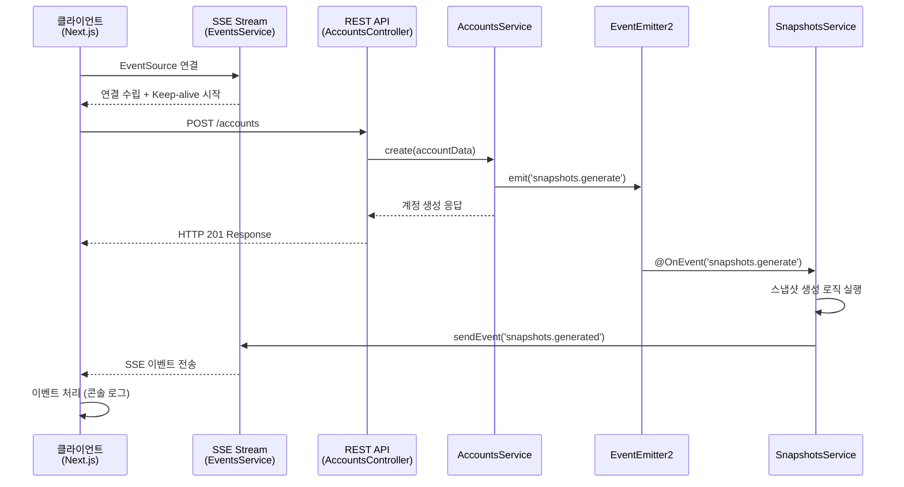

# 이벤트 플로우 가이드

## 📋 개요

이 문서는 시스템 내에서 발생하는 이벤트들의 흐름과 상호작용을 상세히 설명합니다.
이벤트 기반 아키텍처의 핵심인 비동기 통신과 실시간 데이터 전송의 전체적인 플로우를 이해할 수 있습니다.

## 🔄 전체 이벤트 플로우 다이어그램



## 🚀 단계별 상세 플로우

### 1단계: 클라이언트 연결 수립

#### 프론트엔드 (Next.js)

```typescript
// apps/web/app/page.tsx
useEvents(['snapshots.generated'], (eventType) => {
  console.log(`✅ [${eventType}] event received`);
});
```

#### SSE 연결 초기화

```typescript
// apps/web/app/events/useEvents.ts
const eventSource = new EventSource('/api/events/sse');
```

#### 백엔드 스트림 생성

```typescript
// apps/backend/src/events/events.service.ts
getEvent$(userId: string): Observable<MessageEvent> {
  const userStream = this.getOrCreateStream(userId);
  const keepAlive$ = interval(25000).pipe(
    map(() => ({ comment: 'keep-alive' }))
  );

  return merge(userStream.asObservable(), keepAlive$);
}
```

**결과**: 클라이언트와 서버 간 실시간 통신 채널 수립

### 2단계: 계정 생성 API 호출

#### HTTP 요청

```http
POST /accounts
Content-Type: application/json

{
  "name": "홍길동",
  "balance": 1000000
}
```

#### 컨트롤러 처리

```typescript
// apps/backend/src/accounts/accounts.controller.ts
@Post()
createAccount(@Body() createAccountRequest: CreateAccountRequest) {
  return this.accountsService.create(createAccountRequest);
}
```

**결과**: 즉시 HTTP 응답 반환 (비동기 처리와 분리)

### 3단계: 내부 이벤트 발생

#### 서비스 레이어에서 이벤트 발행

```typescript
// apps/backend/src/accounts/accounts.service.ts
create(account: any) {
  this.accounts.push(account);

  // 🔥 핵심: 내부 이벤트 발행
  this.eventEmitter.emit(
    'snapshots.generate',
    new GenerateSnapshotsEvent('123')
  );
}
```

#### 이벤트 객체

```typescript
// apps/backend/src/snapshots/generate-snapshots.event.ts
export class GenerateSnapshotsEvent {
  constructor(readonly userId: string) {}
}
```

**결과**: EventEmitter2를 통해 시스템 내부로 이벤트 전파

### 4단계: 이벤트 리스너 처리

#### 이벤트 수신 및 처리

```typescript
// apps/backend/src/snapshots/snapshots.service.ts
@OnEvent('snapshots.generate')
generateSnapshots(event: GenerateSnapshotsEvent) {
  // 1. 계정 데이터 조회
  const accounts = this.accountsService.getAccounts();

  // 2. 스냅샷 생성
  for (const account of accounts) {
    this.snapshots.push({
      account,
      date: new Date(),
      userId: event.userId,
    });
  }

  // 3. 완료 이벤트 발송
  this.eventsService.sendEvent(event.userId, 'snapshots.generated');
}
```

**결과**: 비즈니스 로직 처리 후 클라이언트 알림 이벤트 생성

### 5단계: 실시간 클라이언트 알림

#### SSE를 통한 이벤트 전송

```typescript
// apps/backend/src/events/events.service.ts
sendEvent(userId: string, eventType: string, data = {}) {
  const userStream = this.userStreams.get(userId);
  if (userStream) {
    userStream.next({
      data: {
        eventType,
        ...data,
      },
    });
  }
}
```

#### 클라이언트 이벤트 수신

```typescript
// apps/web/app/events/useEvents.ts
eventSource.onmessage = (event) => {
  const parsedData = JSON.parse(event.data);
  if (eventTypes.includes(parsedData.eventType)) {
    callback(parsedData.eventType);
  }
};
```

**결과**: 실시간으로 클라이언트에 작업 완료 알림 전달

## ⏱️ 타이밍 다이어그램

```
시간축 ─────────────────────────────────────────────────────►

클라이언트:    [연결] ──── [API 호출] ──────────── [이벤트 수신]
                │           │                        │
서버(HTTP):     │     [요청 처리] ── [응답]          │
                │           │        │               │
서버(Event):    │           │        └─ [이벤트 발행] │
                │           │              │         │
서버(SSE):   [스트림 생성] ─────────────── [이벤트 처리] ── [전송]

시간 경과:    0ms        100ms      150ms        200ms    250ms
```

## 🔍 이벤트 종류별 상세 분석

### 1. 내부 이벤트 (EventEmitter2)

#### snapshots.generate

**발생 시점**: 계정 생성 시
**페이로드**: `GenerateSnapshotsEvent`

```typescript
{
  userId: string; // 대상 사용자 ID
}
```

**처리자**: `SnapshotsService.generateSnapshots()`

### 2. 클라이언트 이벤트 (SSE)

#### snapshots.generated

**발생 시점**: 스냅샷 생성 완료 시
**페이로드**:

```json
{
  "eventType": "snapshots.generated"
}
```

#### keep-alive

**발생 시점**: 25초마다 자동
**페이로드**:

```json
{
  "comment": "keep-alive"
}
```

## 🛠️ 이벤트 시스템의 핵심 특징

### 1. 비동기 분리 (Async Decoupling)

- HTTP 응답과 비즈니스 로직 처리가 완전히 분리
- 사용자는 즉시 응답을 받고, 백그라운드에서 추가 작업 수행

### 2. 느슨한 결합 (Loose Coupling)

- AccountsService는 SnapshotsService의 존재를 직접 알 필요 없음
- 이벤트를 통한 간접적 상호작용

### 3. 확장성 (Scalability)

- 새로운 이벤트 리스너 추가가 기존 코드에 영향 없음
- 다중 이벤트 처리자 등록 가능

### 4. 실시간성 (Real-time)

- SSE를 통한 즉각적인 클라이언트 알림
- 폴링 없이도 상태 변화 감지

## 🔧 이벤트 추가하기

### 새로운 이벤트 타입 추가 예시

#### 1. 이벤트 클래스 정의

```typescript
// src/events/account-updated.event.ts
export class AccountUpdatedEvent {
  constructor(
    readonly userId: string,
    readonly accountId: string,
    readonly changes: any,
  ) {}
}
```

#### 2. 이벤트 발행

```typescript
// AccountsService
updateAccount(accountId: string, changes: any) {
  // 업데이트 로직
  this.eventEmitter.emit(
    'account.updated',
    new AccountUpdatedEvent('123', accountId, changes)
  );
}
```

#### 3. 이벤트 리스너 추가

```typescript
// NotificationService
@OnEvent('account.updated')
handleAccountUpdate(event: AccountUpdatedEvent) {
  // 알림 로직
  this.eventsService.sendEvent(
    event.userId,
    'account.updated',
    { accountId: event.accountId, changes: event.changes }
  );
}
```

#### 4. 클라이언트 구독

```typescript
// React Component
useEvents(['account.updated'], (eventType, data) => {
  console.log('계정이 업데이트되었습니다:', data);
});
```

## 📊 성능 최적화 고려사항

### 1. 메모리 관리

- 사용자별 스트림 분리로 메모리 효율성 확보
- 연결 해제 시 자동 리소스 정리

### 2. 네트워크 최적화

- Keep-alive로 연결 안정성 보장
- 필요한 이벤트만 필터링하여 전송

### 3. 에러 처리

- 이벤트 처리 실패 시 로깅
- 클라이언트 연결 끊김 시 자동 정리

## 🐛 디버깅 가이드

### 이벤트 플로우 추적

```typescript
// 각 단계별 로깅 추가
console.log('🚀 이벤트 발행:', eventName, payload);
console.log('📨 이벤트 수신:', eventName);
console.log('📤 클라이언트 전송:', userId, eventType);
```

### 연결 상태 확인

```typescript
// EventsService에서 연결 상태 모니터링
getConnectedUsers(): string[] {
  return Array.from(this.userStreams.keys());
}
```

### 이벤트 메트릭 수집

```typescript
// 이벤트 발생 횟수 추적
private eventMetrics = new Map<string, number>();

@OnEvent('*')
trackEvent(eventName: string) {
  const count = this.eventMetrics.get(eventName) || 0;
  this.eventMetrics.set(eventName, count + 1);
}
```
